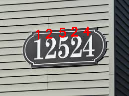
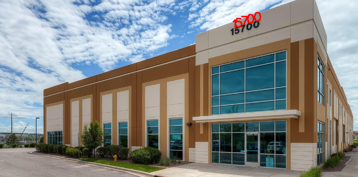
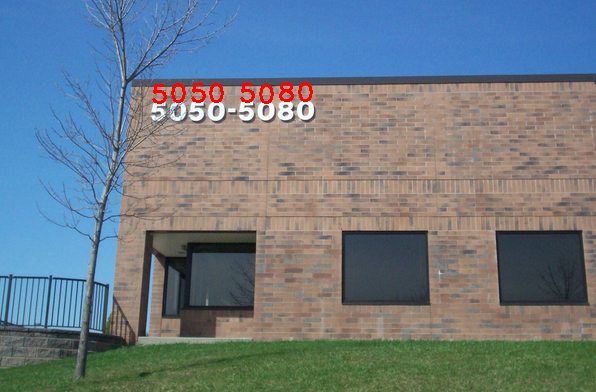
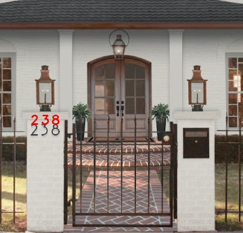
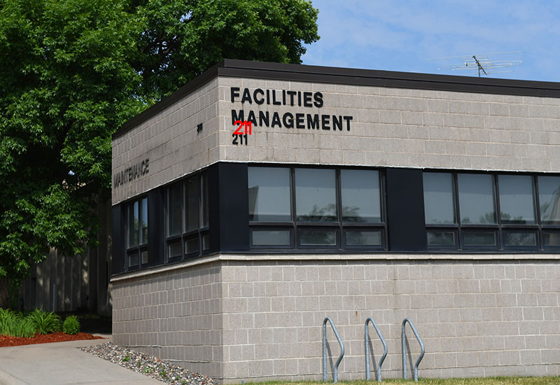
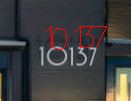

# Digit Classification & Detection with PyTorch + OpenCV

This project combines deep learning and traditional computer vision to classify digits in natural scene images. It uses PyTorch to train a CNN on SVHN and CIFAR10, then leverages MSER (Maximally Stable Extremal Regions) from OpenCV to detect digits in real-world images.

### Features

   Train and evaluate a custom CNN (MyModel) or VGG16 on SVHN + CIFAR10.

   Validation and testing loops with per-class accuracy and confusion matrix.

   Digit detection from raw images using OpenCV's MSER.

   Digit recognition via the trained model, overlaid on original images.

   Save the best model based on validation accuracy.

### Project Structure
```
.
├── my_model.py            # Custom CNN model definition
├── train.py               # Training, validation, and utility functions
├── setup_data.py          # Dataset loading & preprocessing
├── config_mymodel.yaml    # Hyperparameter configuration
├── main.py                # Main training/inference script
├── images/                # Output folder for digit-detected images
└── README.md              # You're here!
```

### Dataset Used

    SVHN (Street View House Numbers)

    CIFAR10 (only the "extra class" labeled as 10)

    Digits are from SVHN (0–9), and CIFAR10 is treated as class 10 to simulate out-of-domain distractors.


### Configuration

Modify the config_mymodel.yaml file to set parameters like:
```
train:
  batch_size: 64
  learning_rate: 0.001
  reg: 0.0005
  epochs: 10
  steps: [6, 8]
  warmup: 0
  momentum: 0.9
  model: MyModel   # or 'vgg16'
  train: True
```

Training

To train the model (either MyModel or vgg16):
```bash
python main.py --config ./config_mymodel.yaml
```

Digit Detection on Real Images

After training (or loading a pre-trained model), the program detects and classifies digits from images using OpenCV:
```bash 
python main.py --config ./config_mymodel.yaml
```
Detected digits will be drawn onto the images and saved into the images/ directory.

Notes

    Make sure to modify MSER parameters (delta, min_area, max_area, distance) in main.py for best results on different images.

    Ensure your image dimensions and dataset align with what the model expects (32x32 RGB).

    find_digit() handles region proposal, cropping, transformation, and prediction.

Future Work

    Integrate CTC for sequence detection

    Replace MSER with a learnable region proposal network

    Expand with more datasets (e.g., MNIST, synthetic)













